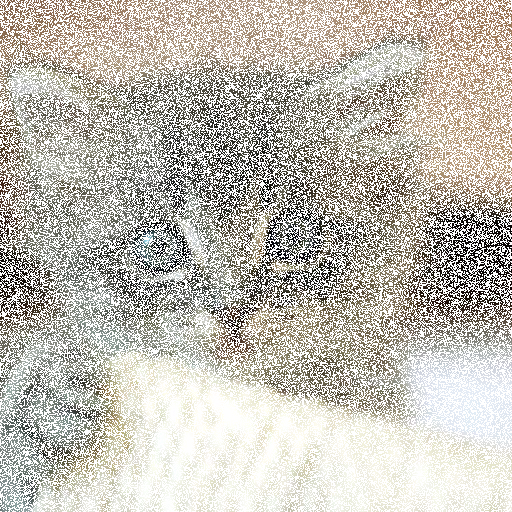
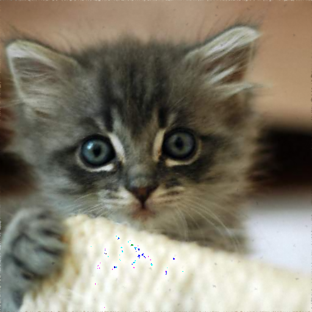
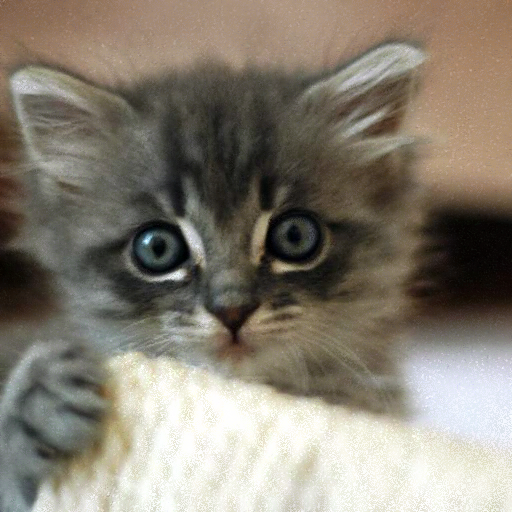

# Image Reconstruction Using Linear Algebra
This project explores multiple methods of image reconstruction using linear algebra. The methods explored are:
* Regularized Least Squares
* Convex LASSO
* Stable Diffusion

## How to Run
1. Clone the repository
2. Install dependencies (numpy, scipy, cvxpy, python-dotenv)
3. Run `python3 main.py`

## Results
Original Image

Regularized Least Squares

Convex LASSO

Stable Diffusion
